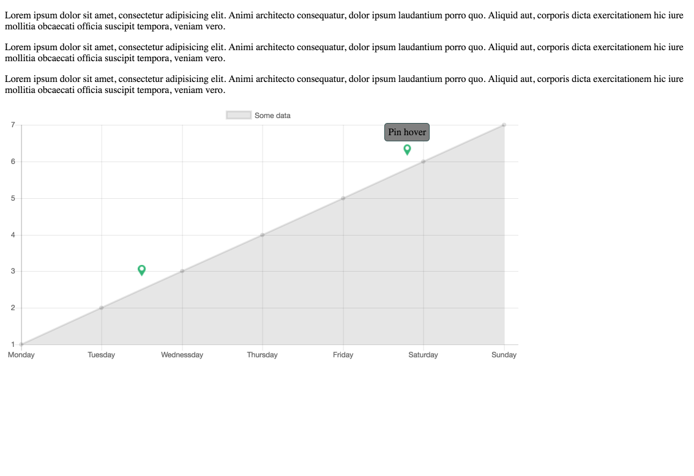

# chartjs-plugin-pinjs

A pin plugin for Chart.js >= 2.4.0

Is only tested with line charts - an does not support custom axes.

So you can create something like this:



## Configuration

To configure the annotations plugin, you can simply add new config options to your chart config.

```javascript
{
	pin: {
		pins: [
		    {
		        //the position in the dataset
               "position": "Tirsdag",
               //How much the pin should be offset to the next tick in percent - so 0.5 would put the tick halfway to
               //the next tick
               "offset": 0.5,
               //Image to show as icon
               "icon": "pin.png",
               //width of image
               "width": 13,
               //height of image
               "height": 20,
               //how much over the max value the image should be shown
               "offsetAbove": 30 
           }],

        // Defines when the annotations are drawn.
        // This allows positioning of the annotation relative to the other
        // elements of the graph.
        //
        // Should be one of: afterDraw, afterDatasetsDraw, beforeDatasetsDraw
        // See http://www.chartjs.org/docs/#advanced-usage-creating-plugins
        drawTime: 'afterDraw', // (default)
        
        // Called with a defined pin when the mouse is over a pin 
        onPinHover: function (chart, pin) {
            
        },
        
        // Called when a pin is clicked
        onPinClick: function (chart, pin) {
        }
    }
}
        

```

## License

Chart.Pin.js is available under the [MIT license](http://opensource.org/licenses/MIT).